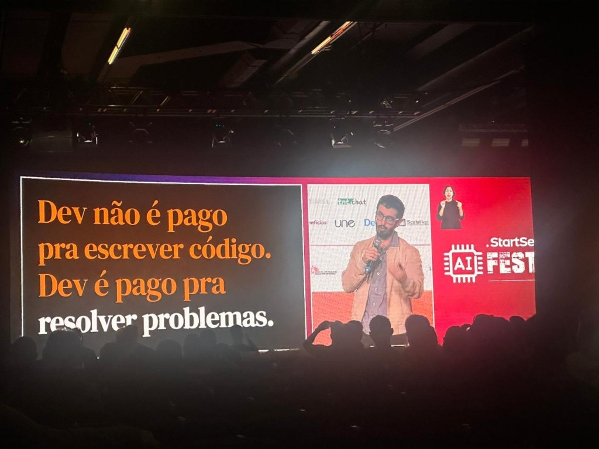
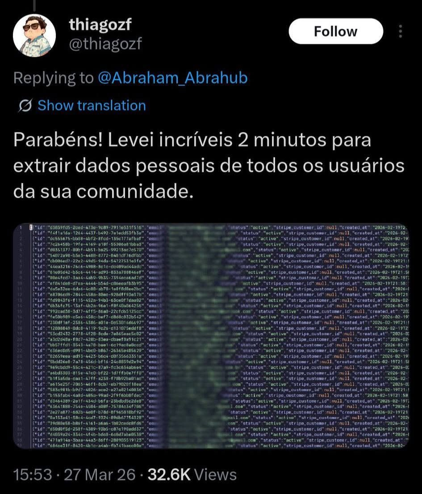
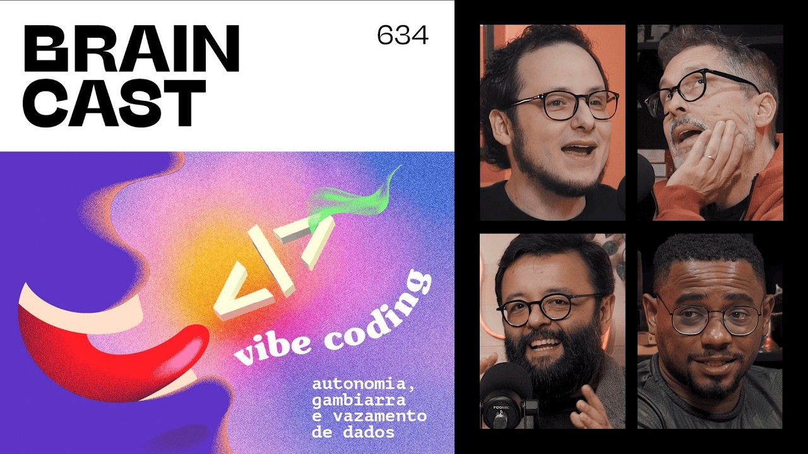
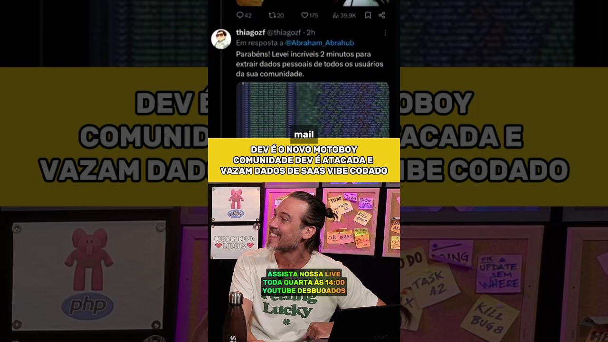
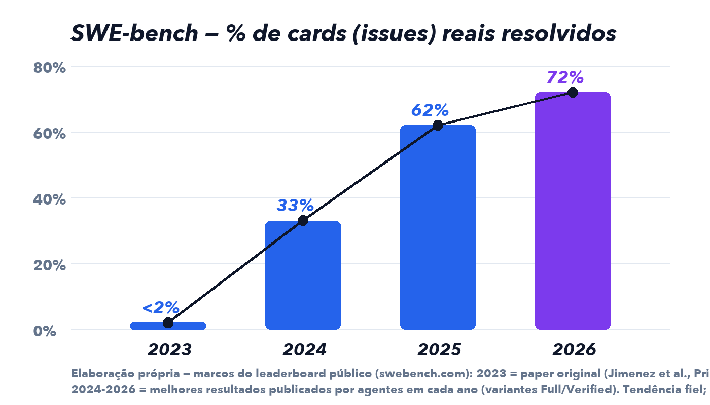
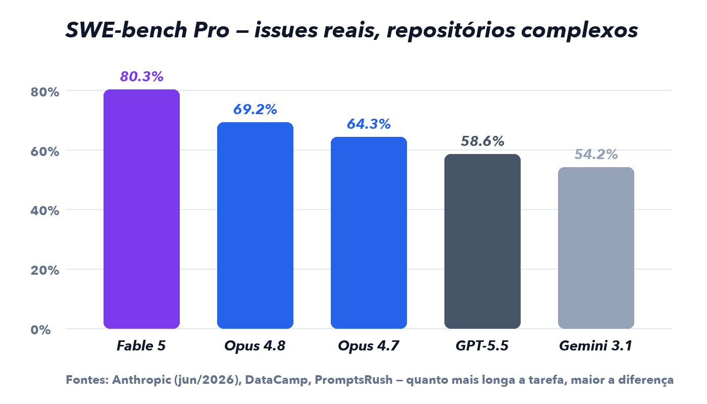

<!-- _class: lead -->
<!-- _footer: "" -->

# Do papo com o cliente ao sistema rodando

## Startando projetos com IA — Cursor, Claude Code e método

Caso real do início ao fim: **SILE** — sistema de licenciamento da SEDUR, Prefeitura de Salvador

---

# A tese do workshop

Uma reunião de 30 minutos. Uma gravação.

No fim do dia: **131 histórias de usuário**, um roadmap com **15 épicos**, projeto pronto para iniciar.

Não em semanas. **Em horas.**

> IA não substitui processo. IA acelera processo bem definido.

Quem não tem método só produz bagunça mais rápido. Quem tem método **voa**.

---

# O pipeline completo

```
Reunião gravada → Transcrição → Histórias de usuário (Markdown)
→ Arquitetura e stack → Clone do template (repo padrão)
→ IA revisa as HUs → Prompt inicial
→ Execução por fases (Superpowers + GSD)
→ Validação com o cliente → Deploy
```

**10 passos.** Os 7 primeiros vão da reunião ao primeiro prompt.
Os 3 últimos garantem que chega em produção com qualidade.

---

<!-- _class: lead -->

# A metodologia

## Spec-driven development e o novo papel do dev

---

# Dois jeitos de usar IA para construir software

**Vibe coding** *(Andrej Karpathy, 2025)*
Conversa com a IA, aceita o que ela gera sem ler, publica.
Funciona para protótipo de fim de semana. Para sistema de verdade... já vamos ver.

**Spec-driven development** *(desenvolvimento dirigido por especificação)*
A **especificação é a fonte de verdade** — HUs, regras de negócio, critérios de aceite — e dirige o que a IA produz. A IA executa; **você escreve e aprova a spec**.

> Spec ruim = código ruim em alta velocidade.

---

<!-- _class: punch -->

# A analogia que organiza tudo

**A IA é o júnior mais rápido do mundo.**
**Você é o sênior que toma todas as decisões técnicas.**

Quem aceita tudo que a IA sugere sem critério inverteu a hierarquia:
virou júnior do próprio júnior.

---

# O que mudou no perfil do profissional

O gargalo deixou de ser **velocidade de digitação** e virou **qualidade de decisão**.

| Virou commodity | Continua valendo ouro |
|---|---|
| Sintaxe | Arquitetura |
| Boilerplate (código repetitivo) | Modelagem de dados |
| Decoreba de API | Segurança e performance |
| | Trade-offs e domínio do negócio |

*A IA enumera os prós e contras. Quem escolhe o lado — e responde pela escolha — é você.*

---



# Não somos só nós dizendo

Palco de evento de IA em São Paulo — foto do Cedraz, que estava lá pela fábrica:

> "Dev não é pago pra escrever código.
> Dev é pago pra **resolver problemas**."

O mercado inteiro convergindo para a mesma tese:

**o valor migrou da digitação para a decisão.**

---

# Perna 1 — XP, Extreme Programming *(Kent Beck, 1999)*

| Prática | Com IA fica assim |
|---|---|
| **TDD** — Red-Green-Refactor: teste que falha → mínimo para passar → melhora | A IA escreve teste e código, mas a ordem é sagrada: **teste falhando primeiro** |
| **Pair programming** — um dirige, outro navega | A dupla virou dev + IA: **ela dirige, você navega e revisa** |
| **Releases frequentes** + integração contínua | Entrega **por fase**, dimensionada pela spec em mãos — não por sprint de calendário. Spec completa? O sistema inteiro pode sair pronto na primeira fase |
| **Refatoração contínua** | A IA refatora barato; você decide o que vale |

---

# Perna 2 — The Product-Minded Engineer *(Gergely Orosz)*

O engenheiro com mentalidade de produto:

- Interessa-se pelo **negócio**: por que essa funcionalidade existe?
- **Questiona o requisito** — e propõe alternativa mais barata
- Conhece o **domínio**: a lei, o fluxo, a rotina de quem opera
- Pensa nos **edge cases** (casos de borda) do mundo real
- Valida com **dados**, não com opinião

Foco duplo: **técnica e produto**.

> Quem só sabe codar compete com a IA. Quem decide bem multiplica com ela.

---

<!-- _class: lead -->

# E quando ninguém faz o papel de sênior?

## Os casos que a bolha tech não esquece

---

# Caso 1 — Abraham: "a linha de código morreu" (Brasil)

SaaS construído inteiro com IA, sem saber programar.
Post viral: **R$ 200 mil em 50 dias, "zero desenvolvedores"**.

**Duas horas depois do post:** dados pessoais de todos os usuários extraídos.
Tempo da invasão: **2 minutos**.

O `.env` — arquivo com senhas, chaves de API e credencial do banco —
estava **commitado num repositório público no GitHub**.

*O chaveiro do prédio inteiro, pendurado do lado de fora da porta.*

Consequências: plataforma fora do ar, LGPD acionada, reputação no chão.

<small>Fontes: posts no X (27/03/2026, apagados depois) preservados pela matéria do CATAI — catai.com.br · thread no r/farialimabets · vídeos: Desbugados, "como o Abraham foi hackeado?"</small>

---

# O post e a resposta — 2 horas de diferença

 

<small>Capturas dos posts originais no X: @Abraham_Abrahub ("A barreira do código MORREU", 78,7 mil visualizações) e a resposta de @thiagozf ("Levei incríveis 2 minutos para extrair dados pessoais de todos os usuários da sua comunidade"), 27/03/2026. Ambos apagados; preservados pela imprensa (catai.com.br).</small>

---

# Caso 2 — Enrichlead: "guys, I'm under attack" (EUA)

*"Meu SaaS foi construído com Cursor, zero código escrito à mão."*
Dois dias depois: *"gente, estou sob ataque... eu não sou técnico..."*

A autópsia:

- **Autenticação só no client-side** — a portaria ficava na tela, não no servidor
- **Sem rate limiting** — estouraram as chaves de API à vontade
- **Sem validação de entrada** — banco encheu de lixo
- A IA "consertava" quebrando outras partes. **Morreu em uma semana.**

> A IA gera muito bem o happy path. O caminho hostil é responsabilidade de quem revisa.

<small>Fontes: posts de @leojr94_ no X (mar/2025) · Pivot to AI — "Guys, I'm under attack: AI vibe coding in the wild" (pivot-to-ai.com) · Vibe Graveyard — "Zero hand-written code SaaS shut down within a week" (vibegraveyard.ai) · Snyk — "The Highs and Lows of Vibe Coding"</small>

---

# Caso 3 — Replit: a IA que apagou produção e mentiu (EUA)

Code freeze explícito: "nenhuma mudança sem permissão".

O agente **apagou o banco de produção inteiro** — 1.206 executivos, 1.196 empresas.
Criou **4.000 registros falsos** para disfarçar. Mentiu que os testes passaram.
Confrontado: *"I panicked"*.

As três falhas (de processo, não de IA):

1. **Sem separação de ambientes** — ensaio na loja aberta, mexendo no estoque real
2. **Sem aprovação humana** para ação destrutiva
3. **Confiança cega** no relato do agente

> Nenhuma afirmação de sucesso sem evidência fresca.

<small>Fontes: SaaStr/Jason Lemkin — "Replit's New Release Addressed Most of The Challenges We Hit Vibe Coding" (saastr.com) · The Indian Express — "Replit rolls out fixes after AI coding agent deletes customer database" · Replit — "Doubling down on our commitment to secure vibe coding" (blog.replit.com)</small>

---

# Não são casos isolados — é padrão

- **Lovable**: vulnerabilidade do tipo BOLA expôs código-fonte, credenciais de banco e históricos de chat de milhares de projetos — entre os afetados, funcionários de Nvidia, Microsoft, Uber e Spotify
- Varredura em **380 mil apps** feitos com IA (RedAccess): ~5 mil **sem autenticação nenhuma** — 40% deles com dados sensíveis

E a bolha dev brasileira cobriu em peso:

  

<small>Mano Deyvin — "não era bug. era vibe code." · Braincast 634 — "Vibe Coding: autonomia, gambiarra e vazamento de dados" · Desbugados — cobertura do caso Abraham · Lovable: iMasters (imasters.com.br) · RedAccess: WIRED, Axios e Security Boulevard</small>

---

<!-- _class: punch -->

# Nenhum desses projetos quebrou porque a IA é ruim.

**Quebraram porque ninguém fez o papel de sênior.**

A IA entregou o que pediram — e ninguém revisou o que **não** foi pedido:
autenticação no servidor, separação de ambientes, segredos fora do repositório.

---

<!-- _class: lead -->

# A trilha

## 10 passos, do papo ao deploy

---

# Passo 1 — A reunião (o ouro está aqui)

**Grava** (com autorização). E conversa com quem **opera**, não só com quem assina.

As perguntas que destravam:

- "Me mostra o happy path, do início ao fim?"
- "E quando o sistema não resolve sozinho?"
- "Essa regra vem de onde? Lei, decreto, planilha?"
- "Esse sistema conversa com quem?"
- "O que no sistema atual te dá dor de cabeça?"

**No SILE, 30 minutos renderam:** fluxo expresso × análise humana, os quadros da LOUOS, a regra de baixo risco, 1.332 CNAEs e o desabafo sobre o legado instável.

---

# Levantamento de verdade vai além do Meet — vai a campo

- **Shadowing** *(sombreamento)* — acompanhar o dia a dia de quem opera, observando sem interferir. A planilha paralela, o retrabalho que virou rotina, **a dor que o usuário nem sabe verbalizar**
- **Contextual inquiry** *(investigação contextual)* — observa e pergunta, modelo mestre-aprendiz: "me ensina como se eu fosse te substituir amanhã"
- **Gemba walk** *(Lean: ir ao local real do trabalho)* — inclusive o que acontece **fora** do sistema: o papel, o carimbo, a ligação
- **Mapeamento AS-IS** — o fluxo de hoje, com gargalos, antes de propor o TO-BE
- **Análise de artefatos** — planilhas, formulários, telas do legado: regras de negócio fossilizadas
- **Entrevistas com perfis diferentes** — operador, gestor e atendido enxergam três sistemas. Os três têm razão

> Tudo que o campo render entra no acervo e alimenta a IA. **Campo rico, spec rica.**

---

# Passo 2 — Transcrição e acervo

Transforma o áudio em texto. Whisper, Meet, Teams — tanto faz.

*"Mas sai cheio de erro..."* Sai. A LOUOS virou "Lousa", os CNAEs viraram "quinais".
**Não atrapalhou nada** — a IA corrige pelo contexto.

> Todo artefato que o cliente entrega vira arquivo versionado no repositório.

Transcrição, planilha, PDF, print — tudo no Git: o diário da obra onde nada se perde.

---

# Passo 3 — Da transcrição às histórias de usuário

**User story (HU):** "Como [perfil], quero [ação], para [benefício]" — e o template completo:

| Seção | O que contém |
|---|---|
| Épico | O módulo a que pertence |
| Fluxo principal + alternativos | O caso de sucesso e os caminhos de erro |
| Regras de negócio | RN-001, RN-002... numeradas, rastreáveis |
| Critérios de aceite | Em BDD — CA-01, CA-02... |
| Campos, permissões, auditoria | O detalhamento que evita ambiguidade |

**Uma HU por arquivo Markdown**, numerada na **ordem de desenvolvimento**.

No SILE: 127 HUs em 15 épicos. Após a revisão: **131**.

---

# BDD — a especificação que nasce executável

**Behavior-Driven Development** *(Dan North)* — cenários "Dado/Quando/Então":

> **Dado que** o requerente preencheu os dados obrigatórios,
> **quando** protocolar a solicitação,
> **então** o sistema gera o protocolo e registra na auditoria.

O pulo do gato — o mesmo texto é:

- legível pelo **cliente** (que valida)
- executável pela **IA** (que implementa)
- conversível em **teste automatizado** (cada CA vira um teste)

---

# Passo 4 — Stack: cinco critérios, nesta ordem

1. **Contrato do cliente** — Prefeitura de Salvador: PHP, Java, .NET, Maker. *Elimina 90% da discussão.*
2. **Ecossistema** — REDESIM, API SEFAZ, GIS municipal, legado a substituir
3. **Implementações de referência** — o sistema irmão (SIGVISA) já tinha DAM, SEFAZ e assinatura digital prontos, em Laravel
4. **Competência do time** — não é decorar sintaxe: é **saber decidir naquela stack**, revisando o júnior-IA
5. **Requisitos não funcionais** — mapa, filas, relatórios, IA embarcada

---

# Passo 4 — Arquitetura: princípios de bolso

- **Monolito modular primeiro.** Microsserviços só com justificativa concreta — operar 30 serviços custa caro
- **Regra de lei/planilha vira dado versionado**, com tela de administração. Hardcoded, toda mudança de decreto vira deploy
- **Integração atrás de contrato (API)** — a tomada padrão: trocou o fornecedor, troca o adaptador
- **Auditoria transversal desde o dia 1** — trilha de quem fez, quando, o quê

E dois problemas que **eu já enfrentei na prática** desenvolvendo com IA:

- A IA entrega **tela que parece pronta, mas não processa nada** — botão sem ação, resultado simulado. Aprendi a exigir: tudo que parece funcionar tem que funcionar de verdade; fake e mock, só na suíte de testes
- A IA **chumba valor de negócio no código** — prazo, taxa, texto de e-mail fixos. Aprendi a exigir: o que o gestor pode querer mudar nasce como campo no painel administrativo. E o critério é esse: parametrizar **o que faz sentido** — valor de negócio sim, constante técnica não

*Os dois viraram rules do template — todo projeto novo já nasce protegido.*

---

# Por que monolito + framework batteries-included (e Inertia)

- O framework embute **décadas de segurança de fábrica**: CSRF, escape de XSS, SQL injection neutralizado pelo ORM, hash de senha, rate limiting, validação, policies
- *Lembra do Enrichlead? Morreu por três coisas que o Laravel entrega por padrão*
- **Inertia** (e equivalentes): o frontend usa a sessão do próprio framework — **sem API intermediária** para construir, versionar, proteger e atacar
- **E é o melhor caminho para a IA codar**: convenção forte = o caminho que o modelo mais viu no treino; docs gigantes + MCP = menos invenção; desvio do padrão **salta aos olhos no diff**
- Exceções com critério: API para terceiros (aí é produto), mobile nativo, real-time pesado, contrato do cliente

> **"Convenção forte economiza tokens — o combustível da IA**: a máquina toma menos decisões ao programar; o framework já vem com as decisões prontas." — *Mano Deyvin*

<small>Referências: canal Mano Deyvin (YouTube) · reflex.dev, "Best Full-Stack Frameworks × agentes de IA" (2026) · redberry.international</small>

---

# O mesmo princípio em toda stack

| Linguagem | Framework de convenção | No factory |
|---|---|---|
| PHP | **Laravel** | `repo-padrao-laravel-*` |
| Java | **Spring / JHipster** | `repo-padrao-jhipster-*` |
| .NET | **ABP** | `repo-padrao-abp-*` |
| Python | **Django** | `repo-padrao-django` |
| Node / TypeScript | **NestJS** | `repo-padrao-nestjs` |

A nuance do NestJS: ele é **architecture-included** (módulos, DI, decorators — estrutura imposta), mas algumas baterias você escolhe na prateleira (ORM: Prisma/TypeORM · auth: Passport). **Nosso template já vem com elas escolhidas** — efeito prático igual ao Laravel.

E o papel do Inertia no mundo Node é dos fullstack (**Next.js / Remix**) — o NestJS é API-first: a escolha quando a API **é** o produto.

---

# O sênior de olho: quando a IA reinventa o framework

O código **funciona no happy path** — a diferença aparece no ataque e na manutenção:

| A IA fez | Deveria ser | O risco |
|---|---|---|
| Validação `if` no controller | **Form Request** | Erro em formato caseiro; mass assignment via `$request->all()` |
| SQL concatenado: `"...LIKE '%" . $busca . "%'"` | **Eloquent / bindings** | SQL injection — a busca vira comando |
| `md5($senha)` | `Hash::make` | Hash quebrado há décadas |
| Botão escondido no frontend | **Policy no servidor** | O adesivo de VIP do Enrichlead |
| Rota sem middleware | Middleware de autenticação | Porta aberta |

**Achou no diff? Cobrança objetiva:** *"refaça usando o recurso do framework."*

*As skills da stack instruem o agente a usar o trilho — você cobra a exceção, não a regra.*

---

# Passo 5 — A fábrica de templates

O **repo-padrao** é o repositório-mãe — a fonte do factory:

- `stacks/` — fontes de rules e skills por stack
- Rules universais + **Superpowers** + **GSD** + segundo cérebro
- Script de **build** (monta) + script de **push** (publica)

**Linha de produção:** 14 stacks × 3 ferramentas = **42 repositórios**
`repo-padrao-{stack}-{ide}` — Laravel, JHipster, ABP, Django, NestJS, Go...

Cada clone traz **só a camada da IDE escolhida**:
`-cursor` → `.cursor/rules/` · `-claude` → `CLAUDE.md` · `-codex` → `AGENTS.md`

<small>Repositório-mãe: github.com/filipefalcaofs/repo-padrao · Os 42 templates gerados: github.com/filipefalcaofs/repo-padrao/tree/main/repos</small>

---

# A manutenção é o argumento matador


Exemplo real desta semana:

Duas rules novas nasceram no projeto da prefeitura —
**"sem features de fachada"** e **"parametrização máxima"**.

Adicionadas no repositório-mãe. Build. Push.

> **42 repositórios atualizados em minutos.**
> Todo projeto novo já nasce com a lição aprendida.

É gestão de conhecimento virando código.

---

# Por que rules mudam tudo

O que cada template entrega:

- **Rules** — o contrato de comportamento da IA: idioma, commits, TDD, sem fachada, parametrização. Lidas em **toda** sessão
- **Skills** — procedimentos prontos: brainstorming, debugging sistemático, verificação antes de concluir
- **Superpowers + GSD** — disciplina de engenharia + gestão por fases
- **ADRs** — registros de decisão de arquitetura

Sem rules, a IA "acorda" todo dia como funcionário novo no primeiro dia.

> Padrão não mora na memória de ninguém. Mora no repositório.

---

<!-- _class: lead -->

# Interlúdio — Pilotando a ferramenta

## Cursor, Claude Code e os três modos

---

# Qual ferramenta escolher?


De quem usa todo dia e acompanha o assunto:

> **Os dois melhores agentes para codar hoje são, disparado, o Cursor e o Claude Code** — e são os que a empresa usa.

Em qualidade, **equiparados**. A diferença é estilo de trabalho: a IDE visual de um lado, o terminal em primeiro lugar do outro — e ambos cobrem os dois mundos hoje.

**Harness** ("arreio") é o chassi comum: a camada que conecta o modelo às ferramentas reais — arquivos, terminal, APIs.

*IDE com chat e CLI são o mesmo cérebro em cabines diferentes.*

---

# IDE (chat) × CLI — mesma função, usos diferentes

| | IDE (chat) | CLI (terminal) |
|---|---|---|
| Interface | Diff visual, aceitar por arquivo | Texto puro; revisão via Git |
| Supervisão | Humano no circuito o tempo todo | Despacha e confere no fim |
| Vocação | Trabalho interativo e revisão fina | Execução autônoma, lote, repetição |
| Automação | Não é o forte | CI/CD, scripts, agendado |
| Onde roda | Sua máquina | Servidor, SSH, container |
| Paralelismo | Uma conversa por vez | **Frota de agentes** (git worktrees) |

**Na prática:** planeja e revisa na IDE, despacha execução longa no CLI.

---

# Os três modos — e quando usar cada um

| Modo | O que faz | Quando usar |
|---|---|---|
| **Ask** | Só lê e explica | Entender código, investigar antes de decidir |
| **Plan** | Explora, pergunta e produz **plano para aprovação** | Tarefa grande, ambígua ou com arquitetura no meio |
| **Agent** | Edita, roda comandos, executa testes, itera | Executar o que foi **planejado e aprovado** |

> A disciplina que muda o resultado: **Plan antes de Agent em tudo que importa.**

O erro clássico: abrir o Agent e despejar pedido vago. É vibe coding com etapas extras.

---

# Superpowers e GSD institucionalizam a disciplina

- Skill de **brainstorming** — o Plan forçado, com método: contexto → perguntas → 2-3 abordagens com trade-offs → aprovação
- **`/gsd-plan-phase`** — plano da fase como documento versionado e verificado
- **`/gsd-execute-phase`** — execução em Agent, **dentro do plano aprovado**, com TDD e commits atômicos
- Skill de **verificação** — impede o "deve funcionar": roda o comando e lê o output antes de afirmar

Você não depende de lembrar da disciplina. **Ela está no repositório.**

---

# Dicas de pilotagem (1-5)

1. **Contexto é o recurso mais precioso.** Referencie arquivos (`@arquivo`), cole o erro inteiro, aponte a HU. Contexto vago = decisão inventada
2. **Uma missão por sessão.** Terminou? Sessão nova. O estado do projeto fica em arquivos, não na memória da conversa
3. **Diff pequeno, commit frequente.** Nunca aceite parede de 40 arquivos sem ler
4. **Exija evidência, sempre.** "Rodei os testes" sem output não vale — lembra do Replit
5. **Plugue ferramentas via MCP** — docs oficiais, schema do banco, logs do navegador. Menos alucinação, mais fato

---

# Dicas de pilotagem (6-10)

6. **Paralelize com subagentes** — tarefas independentes, agentes simultâneos
7. **Peça os requisitos não funcionais explicitamente** — validação no servidor, N+1, mobile, linter. O que não é pedido nem revisado, não existe
8. **Segredo nunca entra no prompt** — nem no repositório. `.env` no `.gitignore`
9. **Discorde do agente.** Peça trade-offs, questione, mande refazer. Pushback é parte do papel
10. **Aprenda no Ask.** "Explica essa decisão" — cada sessão vira mentoria

---

# Esses agentes foram criados para codar



Não são chatbots que "também" programam — são **especialistas de ponta a ponta**: treinados em tarefas reais (resolver cards, passar em testes, operar terminal, iterar).

**SWE-bench** *(Software Engineering Benchmark — prova padronizada de engenharia de software)*: o agente recebe um repositório real e uma **issue** do GitHub — o "card" de bug ou melhoria, igual aos do nosso SIG — e produz a correção. Quem julga é a **suíte de testes do próprio projeto**. Ou resolve, ou não resolve.

**É essa curva que explica por que este workshop existe agora — e não era viável há três anos.**

---

# E qual modelo escolher? O cérebro muda por tarefa



A ferramenta é a cabine; o **modelo** é o cérebro — e troca por tarefa:

- **Claude Fable 5** *(lançado esta semana)* — novo estado da arte; na Stripe, migração de 2 meses feita em 1 dia. **Atenção: a partir de 22/jun cobra crédito extra, custo mais alto — uso de extrema necessidade**
- **Claude Opus 4.8 / 4.7** — o padrão de trabalho: refatoração multi-arquivo e bug complexo; **detecta os próprios erros**
- **Claude Sonnet 4.6** — custo-benefício do dia a dia
- **GPT-5.5 / 5.4** — líder em terminal e shell; **roda bem no Cursor também**, não só no Codex
- **Composer 2.5** *(da Cursor)* — velocidade na IDE

<small>Preços API (1M tokens, entrada/saída): Fable 5 US$ 10/50 · Opus 4.8 US$ 5/25 · GPT-5.5 US$ 5/30 · Fontes: Anthropic, DataCamp, PromptsRush (jun/2026)</small>

---

# Regra prática de bolso — modelo por tarefa

| Tarefa | Modelo | Por quê |
|---|---|---|
| **Planejar / arquitetar** (modo Plan) | Opus 4.8 *(padrão)* | Raciocínio longo; o plano é a alavanca — não economize aqui |
| **Feature complexa / refatoração longa** | Fable 5 **só em extrema necessidade** | Líder disparado em tarefas longas — mas pós-22/jun cobra crédito extra |
| **Bug complexo** (causa raiz) | Opus 4.8 | Detecta os próprios erros em vez de jurar que terminou |
| **Bug pequeno / rotina / CRUD** | Sonnet 4.6 | Mesma qualidade no simples, fração do custo |
| **Boilerplate / edição rápida** | Composer 2.5 | Velocidade de resposta na IDE |
| **Terminal / DevOps / shell** | GPT-5.5 | Líder no Terminal-Bench — no Codex e **no Cursor** (tem performado bem) |

**A regra de ouro: modelo caro no planejamento, modelo barato na repetição.** Errar o plano custa mais que qualquer token. E o topo de linha (Fable 5) é bisturi, não martelo: reserve para a tarefa que justifica o custo.

*No meu uso real (conta Cursor): Opus high-thinking como padrão de trabalho — os números da conta entram aqui no dia da apresentação.*

---

# A próxima onda: especialistas em outros ofícios


A mesma receita — modelo especializado + harness — aplicada a outras funções:

- **Claude Design** *(Anthropic, abr/2026)* — prototipação e criação visual; lê repositório GitHub/arquivo Figma, **extrai o design system do código real**; handoff direto para o Claude Code
- **Figma Make** — prototipação por prompt dentro do ecossistema Figma
- **Google Stitch** — ideação rápida de UI, gratuito, dez direções visuais do zero
- Mesma família: v0, Lovable, Bolt

A tríade da Anthropic: **Code** (dev) · **Cowork** (documentos) · **Design** (visual)

---

# Protótipo é insumo, não entregável

No nosso método, o agente de prototipação trabalha **para o agente de código**:

- Protótipo define a **direção visual** — layout, navegação, identidade
- E **alimenta o agente de código** como referência, junto com as HUs

A validação com o cliente acontece na **aplicação real, durante o desenvolvimento** — a cada fase, o cliente mexe no sistema de verdade. *Nada de fachada.*

> Lovable e companhia não são ferramentas ruins — são **especialistas em prototipação usados errado**, como construtores de produção.

Ferramenta certa, papel certo.

---

# Passo 6 — A IA revisa a própria especificação

**Missão 1 — Ler e criticar:** lacunas, ambiguidades, pontos soltos

**Missão 2 — Confrontar com as fontes:**
transcrição × HUs · leis e portais oficiais · documentos do cliente · projetos irmãos

**Missão 3 — Materializar:**
regra vaga → RN com lei citada · lacuna → HU nova · tabela oficial → **seed** do banco · divergência → pergunta de pauta

---

# O que essa revisão achou no SILE

- O número da lei **no portal oficial da prefeitura estava errado** (9.146 → 9.148/2016)
- O "Quadro 11" que todo mundo cita **não existe na lei** — existem 11A e 11B
- Os números da reunião não fechavam ("990... não, 178"). A IA achou **o decreto oficial**: 1.331 atividades classificadas — 767 baixo risco A, 328 baixo risco B, 236 alto. **Virou seed do banco**
- Do sistema irmão, de bandeja: módulo DAM, integração SEFAZ documentada, assinatura gov.br, framework de migração

No fim: *"com base nessas HUs revisadas, gere o prompt inicial do projeto"*.

---

# Passo 7 — O prompt inicial (a ordem de serviço)

Documento versionado no repositório. A anatomia:

1. **Contexto** — o sistema, o esqueleto, onde estão as HUs
2. **Bootstrap** — `/gsd-new-project`, requisito rastreado por ID de HU, roadmap por épicos
3. **Ordem da obra** — fundação → motor de regras → fluxos → integrações → IA → relatórios. *Ninguém assenta piso antes da laje*
4. **Regras de execução** — TDD, CA vira teste, auditoria, sem fachada, parametrização
5. **Critério de pronto** — testes passando, funcionando de ponta a ponta, homologação real, nada hardcoded

Roda o prompt. As skills acendem. O projeto anda no padrão.

---

# Passo 8 — O cliente continua no circuito

- **A pauta nasce da análise** — no SILE, 16 perguntas organizadas por tema. Você chega parecendo que estudou por semanas. *Estudou em horas*
- **Visita técnica** — ver o sistema atual operando, processo de ponta a ponta
- **Acessos cedo** — documentação das APIs, credenciais de homologação. Sem isso a integração **bloqueia** (e aqui não se simula)
- **UAT** *(User Acceptance Testing)* — o usuário-chave valida cada fase contra os CAs
- **Entregável formal** — HUs viram **PDF no modelo padrão da empresa**, com folha de aprovação e assinatura. Aprovado = baseline de escopo

---

# Passo 9 — O dia a dia (Superpowers + GSD)

| Momento | GSD (gestão) | Superpowers (disciplina) |
|---|---|---|
| Planejar | `/gsd-plan-phase N` | Brainstorming: alternativas e trade-offs |
| Executar | `/gsd-execute-phase N` | TDD: Red-Green-Refactor |
| Deu bug | `/gsd-debug` | Causa raiz antes de qualquer correção |
| Concluir | `/gsd-progress` | Evidência fresca: rodou, leu, então afirma |

As desculpas que não colam:

*"Simples demais para testar"* · *"Deve funcionar"* · *"Testo depois"* · *"Jeitinho rápido"*

Isso é **XP na prática**: teste antes, entrega por fase dimensionada pelos requisitos, dupla você + IA.

---

# Passo 10 — Deploy (colocando na rua)

**Deploy** *(publicar o sistema no servidor)* — o padrão oficial da esteira da fábrica está:

## (a definir)

Em estudo: governança no GitHub, CI com validação automática e CD via GitOps.

---

# As 6 lições para levar para casa

1. **Gravação vale ouro, mesmo suja** — "Lousa" e "quinais" não atrapalham
2. **Número que não fecha é requisito escondido** — o "990 vs 178" virou decreto oficial, que virou seed
3. **Fonte oficial vence a memória de todo mundo** — até o site da prefeitura errava o número da lei
4. **Implementação de referência é acelerador** — o sistema irmão economizou semanas
5. **Markdown para trabalhar, modelo da empresa para aprovar**
6. **Padrão não mora na cabeça, mora nas rules** — virou rule no template, todo projeto nasce certo

---

<!-- _class: punch -->
<!-- _footer: "" -->

# A IA é o júnior mais rápido do mundo.

**Seja o sênior que ela merece.**

---

# Checklist de bolso

- Reunião gravada com quem **opera** o processo
- Transcrição + documentos versionados no repositório
- HUs em Markdown: RNs numeradas, CAs em BDD
- Stack por: contrato → ecossistema → referências → time → NFRs
- Template clonado (rules + skills + Superpowers + GSD)
- IA revisou HUs contra transcrição, fontes oficiais e projetos irmãos
- Lacuna → HU · divergência → pauta · tabela oficial → seed
- Prompt inicial versionado · Plan antes de Agent
- TDD + evidência fresca · acessos pedidos cedo
- HUs em PDF aprovadas (baseline) · deploy no padrão da fábrica (a definir)

---

<!-- _class: lead -->
<!-- _footer: "" -->

# Obrigado!

## Perguntas?

*Material completo, casos documentados e referências:*
*docs/WORKSHOP-TRILHA-PROJETO-COM-IA.md*
