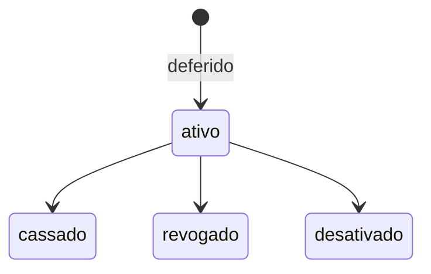

# Desfecho da análise e ciclo de vida do produto — design

**Data:** 2026-07-14 · **Revisão:** 2 (visibilidade/SEFAZ esclarecidas pela SEDUR)
**Origem:** Relatório de teste SEDUR (Lisa Santos, 2026-07-09) + confirmações da SEDUR 2026-07-14 (resposta 3 + esclarecimento SEFAZ).
**Status:** RASCUNHO — `[OPEN-A]` (visibilidade/SEFAZ) **RESOLVIDO** (§4): produto = visualização só interna; **deferimento E indeferimento são informados à SEFAZ via API** ao final. Restam **detalhes** (não bloqueiam a arquitetura): modelos de tarja, regras de validade, permissões de cassar/revogar/desativar, regra de taxa.
**Relacionado:** `2026-07-14-status-analise-processo-design.md` — o status `analise_concluida` e o `convite_expirado` **acionam** este recurso.

> ⚠️ Contém regras confirmadas pela SEDUR (§7.1) e premissas `[OPEN]` a confirmar. Nada vira código antes da confirmação.

---

## 1. Problema

"Análise Concluída" (relatório pág. 6) não é um simples status: é a **conclusão da análise com um desfecho**, e cada desfecho tem consequências sobre o **produto** (TVL), a **taxa**, a **SEFAZ** e a **inscrição imobiliária**. Hoje o sistema modela apenas dois desfechos:
- `App\Enums\DecisionOutcome` = `deferida` | `indeferida`;
- `ViabilityRequestStatus` = …`deferida`|`indeferida` (finais);
- produto = `TvlDocument` / `tvl_product_number` (gerado no deferimento);
- transmissão = `SefazViabilidadeGateway` (+ Regin).

A SEDUR pediu **cinco** desfechos e um **ciclo de vida pós-deferimento** que não existem.

## 2. Desfechos (SEDUR §7.1)

| Desfecho | Quando | Efeito |
|---|---|---|
| **Deferido** | Análise conclui favorável | Gera produto (visualização só interna); pede **Validade** (Definitivo/Pré-operacional); **informa a SEFAZ o desfecho + validade via API** |
| **Indeferido** | Análise conclui desfavorável, ou **convite expirado** | **Não** gera produto; **não** gera taxa; **informa a SEFAZ o indeferimento via API** |
| **Cassado** | Processo **já deferido** (com produto) | Produto recebe status Cassado; **tarja vermelha "CASSADO"** (modelo virá da SEDUR) |
| **Revogado** | Processo **já deferido** (com produto) | Status Revogado; **tarja vermelha "REVOGADO"** |
| **Desativado** | Processo **já deferido** (com produto) | Status Desativado; **tarja vermelha "DESATIVADO"** |

**Escritório virtual (sede):** nos casos **Indeferido / Cassado / Revogado / Desativado**, o sistema deve **desvincular a inscrição imobiliária** da viabilidade anteriormente deferida.

> **Serviço de desvinculação COMPARTILHADO.** A desvinculação da inscrição (+ desvincular/notificar abrigados + informar SEFAZ) tem DOIS gatilhos em specs distintas: aqui (desfechos indef/cassado/revogado/desativado) e na spec de escritório virtual `2026-07-16-escritorio-virtual-motor-design.md` RN-EV-06 (mudança de endereço da sede). Ambos DEVEM chamar **um único** serviço (ex.: `DesvincularInscricaoService`) — não duplicar. Na mudança de endereço, o abrigado é **desvinculado + notificado** (sem cassação automática, SEDUR 2026-07-16); nos desfechos, segue o efeito do desfecho.

## 3. Modelo de domínio proposto

Dois eixos distintos (não confundir):

1. **Desfecho da decisão** (`DecisionOutcome`) — o veredito da análise: manter `deferida` | `indeferida`. `Cassado/Revogado/Desativado` **não** são desfechos de análise — são **eventos de ciclo de vida do produto já emitido** (pós-deferimento).
2. **Ciclo de vida do produto** (novo) — status do produto/TVL após o deferimento: `ativo` | `cassado` | `revogado` | `desativado`.

> `[OPEN-B]` Confirmar essa separação (desfecho × ciclo de vida do produto) vs. tratar os 5 como um enum único. Recomendação: separados — cassação/revogação/desativação agem sobre um produto **existente**, com trilha própria e (provavelmente) permissão distinta da de deferir.

### 3.1 Validade do produto (deferido)
Novo campo `validade` no produto/decisão: `definitivo` | `pre_operacional`. Exigido ao deferir; consta no produto (campo "Validade") e é **transmitido à SEFAZ**.
> `[OPEN-C]` Regras de negócio da validade (o que distingue Definitivo de Pré-operacional; se Pré-operacional tem prazo/renovação). Payload SEFAZ da validade.

### 3.2 Ciclo de vida pós-deferimento (cassado/revogado/desativado)
Transições sobre um produto `ativo`:

- Só a partir de `ativo` (produto existente).
- Cada transição: exibe tarja vermelha ao **usuário interno** (modelo `[OPEN-D]`), grava status + auditoria, e (se escritório virtual) **desvincula a inscrição**.
> `[OPEN-E]` Quem pode cassar/revogar/desativar (permissão), e a distinção de negócio entre os três (hoje têm o mesmo efeito técnico: tarja + status + desvinculação de inscrição para escritório virtual).

## 4. Visibilidade do produto e SEFAZ — `[OPEN-A]` RESOLVIDO (2026-07-14)

SEDUR §7.1: o produto *"é gerado apenas para visualização dos usuários internos da SEDUR. NÃO PODE FICAR DISPONÍVEL PARA O USUÁRIO EXTERNO."* Esclarecimento (2026-07-14): **o desfecho — tanto deferimento quanto indeferimento — é informado à SEFAZ via API** ao final.

**Desenho resultante:**
- O **produto/TVL (PDF)** no Viabiliza é **visualização só interna** — o Viabiliza **não** faz entrega direta do documento ao cidadão.
- A **SEFAZ (via API)** é o canal de saída oficial do **desfecho** (deferido **e** indeferido) + a **validade** (no deferido). A SEFAZ trata a via externa/fiscal ao cidadão.
- Reusa/estende `SefazViabilidadeGateway`; hoje há evento `sefaz-viabilidade` na trilha (`ResultadoExpressoController::transmissao`). A cobertura passa a incluir **indeferimento** explicitamente.

> `[OPEN-A-resid]` (menor) Confirmar se o **Regin** (parecer à Junta) segue no fluxo além da SEFAZ, e o **payload** exato do desfecho/validade para a SEFAZ. Não bloqueia a arquitetura.

## 5. Integração com o outro spec
- `convite_expirado` (§5.2 do outro spec) → desfecho **Indeferido** com motivo "prazo expirado do convite" + arquivo virtual. Reusa o indeferimento aqui definido.
- `analise_concluida` → tela de conclusão que oferece os desfechos conforme o estado atual do processo (deferir/indeferir se ainda não decidido; cassar/revogar/desativar se já deferido com produto).
- **Deferimento gated por permissão** (SEDUR §7.1-2 do outro spec / vistoria): só quem tem permissão defere; vistoriador não.

## 6. Fases sugeridas
1. Validade do produto (Definitivo/Pré-operacional) no deferimento + **transmissão SEFAZ do desfecho (defer/indefer) + validade via API** (estende `SefazViabilidadeGateway`).
2. Visibilidade do produto: garantir que o TVL/PDF é só visualização interna (sem entrega externa direta pelo Viabiliza).
3. Ciclo de vida do produto (cassado/revogado/desativado) + tarjas (modelos da SEDUR, `[OPEN-D]`) + auditoria.
4. Desvinculação de inscrição para escritório virtual (indef/cassado/revogado/desativado).

## 7. Fontes

### 7.1 Resposta 3 da SEDUR (2026-07-14)
- Análise Concluída → Deferido/Indeferido/Cassado/Revogado/Desativado.
- **Deferido:** produto só para usuários internos (não ao externo); opções de **Validade: Definitivo e Pré-operacional**; validade consta no produto e é enviada à **SEFAZ**.
- **Indeferido:** sem produto; sem taxa.
- **Cassado/Revogado/Desativado:** só quando já havia deferimento com produto; **tarja vermelha** com o nome (modelo virá); processo recebe o status.
- **Escritório virtual:** indeferido/cassado/revogado/desativado → **desvincular a inscrição imobiliária** da viabilidade antes deferida.
- **SEFAZ (esclarecimento 2026-07-14):** tanto o **deferimento** quanto o **indeferimento** são **informados à SEFAZ via API** ao final.

### 7.2 Código (evidência)
- `app/Enums/DecisionOutcome.php` — hoje só `deferida`/`indeferida`.
- `app/Models/ViabilityDecision.php`, `app/Models/TvlDocument.php`, `app/Models/TvlSequence.php`, `app/Services/Analise/TvlPdfService.php` — produto/TVL.
- `app/Services/Sefaz/SefazViabilidadeGateway.php` — transmissão SEFAZ.
- `app/Http/Controllers/Gestao/ResultadoExpressoController.php` (`transmissao`) — entrega Regin/SEFAZ atual (base do `[OPEN-A]`).
- `app/Models/ViabilityRequest.php` (`property_registration`) + fontes de escritório virtual (`ProcessoQueryService`, `EscritorioVirtualReportSource`) — desvinculação de inscrição.

## 8. Questões abertas (para SEDUR)
- ~~`[OPEN-A]`~~ **RESOLVIDO (2026-07-14):** produto = visualização só interna; **desfecho (defer E indefer) informado à SEFAZ via API** (§4). Resíduo menor: Regin segue? payload exato?
- `[OPEN-B]` Desfecho × ciclo de vida do produto separados (recomendado) ou enum único?
- `[OPEN-C]` Regras da Validade (Definitivo × Pré-operacional; prazo/renovação; payload SEFAZ).
- `[OPEN-D]` Modelos das tarjas (CASSADO/REVOGADO/DESATIVADO) — SEDUR enviará.
- `[OPEN-E]` Permissão e distinção de negócio entre cassar/revogar/desativar.
- `[OPEN-F]` Geração de taxa (só menciona "indeferido não gera taxa"); regra de taxa no deferimento.
