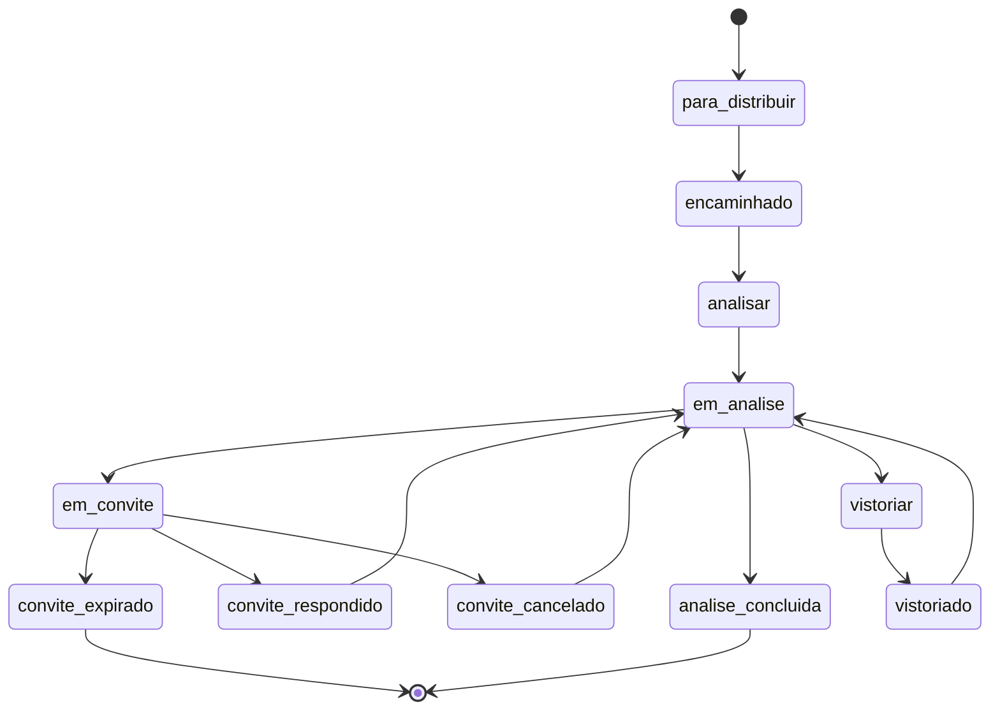

# Status da análise do processo (motor convite/vistoria) — design

**Data:** 2026-07-14 · **Revisão:** 3 (confirmações da SEDUR incorporadas)
**Origem:** Relatório de teste SEDUR (Lisa Santos, 2026-07-09), pág. 6 — tela `/gestao/processos`.
**Status:** RASCUNHO — a maioria das premissas foi confirmada pela SEDUR (2026-07-14); resta `[OPEN]` pontual e o recurso de **desfecho da análise** foi movido para spec próprio (§13).

> ⚠️ **Aviso de premissas.** O relatório de teste forneceu apenas os 11 *nomes* de status; as regras vieram da SEDUR em 2026-07-14 (transcritas em §12.1). Nada aqui recria regra de domínio silenciosamente.

> 🔁 **Rev. 2 — reconciliação com o código.** Descobriu-se que o "convite" já existe como o subsistema de **Pendência** (`AnalysisPendency` + `AnalysisPendencyStatus` aberta/respondida/expirada, job `pendencias:expirar`, resposta pelo portal, status canônico `em_pendencia`). **A SEDUR confirmou** (§12.1-1) que convite = comunicação com o requerente para esclarecimento (justificativa escrita e/ou anexo) — ou seja, é exatamente a pendência. O convite **estende** esse subsistema, não cria tabela nova.

> ✅ **Rev. 3 — confirmações da SEDUR (2026-07-14).** Mudanças relevantes vs. rev. 2:
> 1. **Renomear "pendência" → "convite" em TODO o domínio** (modelo, tabela, comando, rotas, portal, status canônico, testes). A SEDUR não usa "pendência".
> 2. **Expiração do convite = INDEFERIMENTO AUTOMÁTICO** — reverte a decisão da rev. 2 ("expira+notifica+mantém"). Prazo **48 horas ÚTEIS** (exclui fins de semana e feriados cadastrados). Vira status "Indeferido por prazo expirado do convite" e vai para **arquivo virtual** (sai da caixa do setor **e** do analista).
> 3. **Convite cancelado exige parecer** com o motivo do cancelamento.
> 4. **Vistoria ENTRA no escopo** do Viabiliza (`[OPEN-10]` resolvido) — reusa a **ficha de vistoria**; sem termo assinado.
> 5. **Filtro da pág. 6 reusa campo existente** (`[OPEN-9]` resolvido) — sem campo novo.
> 6. **Encaminhado para** = dropdowns Setor + Usuário; processo **fica na caixa do setor** com o status indicando o usuário.
> 7. **"Análise Concluída"** revelou-se um recurso próprio (5 desfechos + produto/validade/SEFAZ/cassação/escritório virtual) → **spec separado** (§13).

---

## 1. Problema

Na tela `/gestao/processos` o campo "Grupo de status" lista 4 grupos macro e o "Status" reflete o `ViabilityRequestStatus` canônico. A SEDUR pediu que o analista possa **selecionar o status operacional de cada processo em análise** a partir de 11 estados inexistentes hoje:

1. Analisar · 2. Em análise · 3. Análise concluída · 4. Em convite · 5. Convite respondido · 6. Convite cancelado · 7. Prazo para convite expirado · 8. Encaminhado para · 9. Para distribuir · 10. Vistoriar · 11. Vistoriado

OBS do relatório: *"Todas essas opções deverão ficar disponíveis para selecionar o status de cada processo que vier para análise."*

## 2. Objetivos / Não-objetivos

**Objetivos**
- Introduzir um estado **operacional da análise** (`analysis_status`) que o analista gerencia, paralelo ao `ViabilityRequestStatus` canônico.
- **Convite**: reusar e estender o subsistema de Pendência, com o **rename de domínio pendência→convite**, o estado **cancelado** (com parecer) e a nova regra de **expiração = indeferir + arquivar** (48h úteis).
- **Vistoria** (em escopo, §5.3): tramitar ao setor de vistoria, preencher a ficha de vistoria, retornar ao analista.
- Expor para seleção (detalhe/ficha), como filtro na consulta (reusando campo existente) e na exibição.
- Registrar cada mudança na trilha de auditoria e numa timeline interna (RN-002).

**Não-objetivos**
- **Não** altera o motor expresso nem a explicabilidade.
- **Não** modela os **desfechos** deferido/indeferido/**cassado/revogado/desativado**, a **validade** do produto, a transmissão à SEFAZ nem a **desvinculação de inscrição** de escritório virtual → **spec próprio** (§13). Aqui, `analise_concluida` apenas *aciona* aquele recurso.
- **Não** cria segundo mecanismo de prazo/expiração paralelo ao convite (ex-pendência).

## 3. Decisão de arquitetura

Campo **paralelo e manual** (`analysis_status`) para o **eixo de status operacional**. Os **sub-fluxos** (convite/vistoria) **não** são greenfield — reusam infraestrutura existente (§3.1).

| Abordagem | Veredito |
|---|---|
| **A. Campo paralelo manual** | ✅ Escolhida (eixo de status) |
| B. Estender `ViabilityRequestStatus` | ❌ blast radius enorme |
| C. Reusar só `AnalysisStage` | ❌ insuficiente (mas coexiste, §3.1) |

### 3.1 Reconciliação com subsistemas existentes

`analysis_status` **não pode ser uma quarta fonte de verdade divergente** — espelha/deriva dos eixos existentes.

| Fase/estados | Já modelado por | Reconciliação |
|---|---|---|
| `para_distribuir`, `encaminhado` | `AnalysisStage::Distribuicao` + atribuição `sector_id`/`assigned_user_id` | `encaminhado` = tem atribuição de setor/usuário; `para_distribuir` = sem. Destino já persistido — não criar campo novo. |
| `analisar`, `em_analise`, `analise_concluida` | `AnalysisStage::Analise` + canônico `em_analise` | Detalhamento operacional dentro da etapa `analise`. Invariante: status de análise ⇒ `analysis_stage = analise`. `analise_concluida` aciona o desfecho (§13). |
| `em_convite`, `convite_respondido`, `convite_cancelado`, `convite_expirado` | `AnalysisPendency`→**Convite** + canônico `em_pendencia`→**em_convite** | §5.2. |
| `vistoriar`, `vistoriado` | aba "Vistoria" do detalhe (HU-082 RN-006) + ficha de vistoria (vagas: `analysis_records.parking`) | Em escopo — §5.3. |

## 4. Modelo de domínio

### 4.1 Enum `AnalysisStatus`

`App\Enums\AnalysisStatus` (backed string), agrupado:

| valor | rótulo | grupo |
|---|---|---|
| `para_distribuir` | Para distribuir | Distribuição |
| `encaminhado` | Encaminhado para | Distribuição |
| `analisar` | Analisar | Análise |
| `em_analise` | Em análise | Análise |
| `analise_concluida` | Análise concluída | Análise |
| `em_convite` | Em convite | Convite |
| `convite_respondido` | Convite respondido | Convite |
| `convite_cancelado` | Convite cancelado | Convite |
| `convite_expirado` | Prazo para convite expirado | Convite |
| `vistoriar` | Vistoriar | Vistoria |
| `vistoriado` | Vistoriado | Vistoria |

Rótulos confirmados pela SEDUR (§12.1-4: "pode utilizar esses mesmo").

### 4.2 Máquina de estados (`AnalysisStatusStateMachine`)

**Grafo híbrido** (rev. anterior, mantido): transições **manuais do analista** validadas por `AnalysisStatusStateMachine` (espelha `ViabilityRequestStateMachine`: mapa explícito, exceção em transição inválida, timeline + auditoria com `actor`/`reason`). Estados **dirigidos por evento** não entram no dropdown manual. **Override do gestor** (role `gestor`) força qualquer transição com `reason` obrigatório e auditado.

| Estado (destino) | Como é setado |
|---|---|
| `para_distribuir`, `encaminhado` | Gestor via `distribuir-processos` (caixa do setor) — §7 |
| `analisar`, `em_analise`, `analise_concluida` | Transição manual validada (analista) |
| `em_convite` | Emitir convite (`ConviteService`, ex-`PendenciaService`) |
| `convite_cancelado` | Cancelar convite (analista) — **parecer obrigatório** |
| `convite_respondido` | Sistema — resposta do requerente pelo portal |
| `convite_expirado` | Sistema — job `convites:expirar` → **indefere + arquiva** (§5.2, §6) |
| `vistoriar`, `vistoriado` | Manual (analista tramita à vistoria; vistoriador devolve) — §5.3 |

**Inicialização:** `analysis_status` materializa `null → para_distribuir` na mesma transação que hoje seta `analysis_stage = Distribuicao` (`FluxoExpressoService::encaminharAnalise`, evento `EncaminhadoParaAnalise`). Invariante: canônico `em_analise` ⇒ `analysis_status` materializado.

### 4.3 Relação com o status canônico

- `em_convite` → canônico `em_convite` (ex-`em_pendencia`, renomeado). Responder reabre `em_convite → em_analise` (já existe no serviço).
- `convite_expirado` → **aciona indeferimento automático** (§13) com o desfecho "Indeferido por prazo expirado do convite" + arquivo virtual.
- `analise_concluida` → aciona o recurso de **desfecho** (§13); não decide sozinho no eixo de status.

## 5. Dados

### 5.1 Coluna em `viability_requests`
- `analysis_status` (string, nullable; default `null`). Materializa `null → para_distribuir` junto com `analysis_stage = Distribuicao`.

### 5.2 Convite — renomear e estender o subsistema de Pendência

**Rename de domínio (SEDUR §12.1-1 OBS):** `AnalysisPendency`→`Convite`, tabela `analysis_pendencies`→`convites` (migração), `AnalysisPendencyStatus`→`ConviteStatus`, `PendenciaService`→`ConviteService`, comando `pendencias:expirar`→`convites:expirar`, rotas/telas do portal e gestão, e o status canônico `em_pendencia`→`em_convite`. Inventário e migração de dados na Fase 2.

Mapeamento de estados:

| Convite | Estado |
|---|---|
| em convite | `aberta`→`em_convite` (canônico `em_convite`) |
| convite respondido | `respondida` (`response`, `responded_at`) |
| convite cancelado | **novo** `cancelada` — exige **parecer/motivo** |
| prazo expirado | `expirada` → **indefere + arquiva** |
| prazo | `due_at` = **48 horas úteis** (parâmetro novo `analise.convite.prazo_resposta_horas_uteis` = 48) |
| motivo | `description` |
| resposta | `response` |

**Prazo em horas úteis (SEDUR §12.1-5):** 48h úteis, excluindo fins de semana e feriados cadastrados. Hoje `BusinessDeadlineCalculator::dueAt` usa `addHours` (horas-calendário) e o docblock diz "dias úteis depende de confirmação" — **agora confirmado**. Adicionar `dueAtBusinessHours()` reusando o desconto de fim de semana/feriado que já existe em `businessDurationBetween` (+ `HolidayProvider`). Trocar o parâmetro (era `analise.pendencia.prazo_resposta_dias = 15`).

**Expiração = indeferir (SEDUR §12.1-6):** ao expirar, o processo é **indeferido automaticamente** (desfecho "Indeferido por prazo expirado do convite" — §13), sai da caixa do setor e do analista e vai a **arquivo virtual**. Isto **reverte** a decisão da rev. 2 ("mantém estado"); o "rito de não-resposta" antes deliberadamente não inventado (spec 2026-06-15) agora foi fornecido pela SEDUR.

### 5.3 Vistoria — EM ESCOPO (`[OPEN-10]` resolvido)

SEDUR (§12.1-2): a vistoria faz parte da análise e fica dentro do processo. Regras confirmadas:
- **Gatilho:** o **analista** seleciona `vistoriar` **antes de concluir a análise**, quando julga necessário. **Nem todo processo** precisa.
- **Fluxo:** ao selecionar `vistoriar`, o processo é **tramitado ao setor de vistoria** (encaminhamento a setor — reusa `sector_id`, §3.1). Os **vistoriadores** preenchem a **ficha de vistoria** (tópicos solicitados pelo analista + parecer do vistoriador) e **tramitam de volta** ao analista → `vistoriado`.
- **Ficha de vistoria (não termo):** **não existe termo assinado** na SEDUR (corrige a premissa da rev. 1). Existe a ficha de vistoria — reconciliar/estender a aba "Vistoria" (HU-082 RN-006) e as "vagas vistoria" (`analysis_records.parking`) antes de criar estrutura nova; provavelmente uma tabela `vistorias` (itens solicitados + respostas + parecer + vistoriador + tramitações), a detalhar na Fase 3.
- **Permissões:** o **vistoriador só insere** informações e devolve; **não defere**. O deferimento é de quem tem a permissão (§13).
- **Ficha de análise pode estar só "Salva":** tramitar à vistoria **não** exige ficha de análise fechada/concluída.

> `[OPEN-7-resolvido]` Gatilho = manual pelo analista; executor = setor de vistoria; `vistoriado` **não** bloqueia tecnicamente a decisão, mas na prática precede a conclusão (o analista usa o parecer da vistoria). Confirmar apenas se algum CNAE/risco **exige** vistoria obrigatória.

### 5.4 Timeline — tabela própria `analysis_status_transitions`
Tabela dedicada espelhando `ViabilityRequestTransition` (`from_status`/`to_status` como `AnalysisStatus`, `reason`, `actor_user_id`), **sem** `public_label`, escrita pela máquina de estados e exibida na **timeline interna** (analista) — **não** na `TimelineSolicitacao` do cidadão (evita vazar estados internos; LGPD/UX).

## 6. Jobs agendados
- **`convites:expirar`** (renomeado de `pendencias:expirar`; já agendado diário 06:00, idempotente): convites `em_convite` com `due_at` (48h úteis) vencido → **indefere** (§13), registra desfecho, remove das caixas (arquivo virtual), notifica, timeline + auditoria. **Muda** o comportamento anterior (que só notificava e mantinha).

## 7. Superfícies de UI
- **Selecionar status** (detalhe/ficha, `analisar-processos`): dropdown oferece só as **próximas transições válidas**; estados dirigidos por evento (respondido/expirado/distribuição) não aparecem como opção manual. Gestor vê o **override** (justificativa obrigatória). Cancelar convite exige **parecer**. Emitir convite reusa a UI/serviço do convite (ex-pendência); a **resposta é pelo portal** (não botão do analista).
- **Encaminhado para** (SEDUR §12.1-7): ao selecionar, exibir **Setor** (todos os setores da secretaria) + **Usuário**. O processo **NÃO** vai à caixa do usuário — **fica na caixa do setor** com o status `encaminhado` indicando o usuário. (Detalhe pleno na tela Fila, pág. 4-5/7.)
- **Filtro na consulta** (pág. 6, SEDUR §12.1-4): **reusar o campo de status existente** (sem criar campo novo); os 11 valores de `analysis_status` ficam disponíveis para seleção. Reconciliar com o "Grupo de status" macro e o "Status" canônico já presentes.
- **Exibição:** badge no detalhe e coluna na lista/fila. Vistoria: ação de tramitar à vistoria + visualização da ficha de vistoria.

## 8. Auditoria
Toda transição grava `AuditService::log('analise','status-analise',...)` + timeline própria. Sem mudança silenciosa.

## 9. Testes
- Unit: `AnalysisStatus` (labels/grupos), `AnalysisStatusStateMachine` (transições válidas/inválidas), invariantes de reconciliação (§3.1), `dueAtBusinessHours` (48h úteis pulando fds/feriado).
- Feature: setar status só nas transições manuais válidas; **override do gestor exige `reason`** (403 auditado p/ não-gestor); **cancelar convite exige parecer**; convite reusando o subsistema renomeado (emitir/cancelar/expirar); **expiração indefere + arquiva** (não mais "mantém"); resposta pelo portal; vistoria (tramitar→ficha→devolver, vistoriador não defere); filtro reusando campo existente; auditoria.
- Regressão: rename pendência→convite sem quebrar o subsistema; motor expresso intacto; nenhum job/param/tabela duplicado.

## 10. Fases sugeridas
1. Enum + coluna + máquina + set/exibição + **filtro reusando campo** + invariantes (§3.1).
2. Convite = **rename de domínio pendência→convite** (modelo/tabela/comando/rotas/portal/status canônico/testes + migração) + estado `cancelada` (parecer) + **prazo 48h úteis** + **expiração=indeferir+arquivar** (`convites:expirar`).
3. Vistoria — tramitação ao setor de vistoria + ficha de vistoria (reconciliar aba/vagas existentes) + retorno ao analista; vistoriador sem deferir.
4. Integração com a fila (encaminhado/distribuir: Setor+Usuário, fica na caixa do setor) — junto da tela Fila.

## 11. Questões abertas
- `[OPEN-1]` ~~rótulos~~ **RESOLVIDO** (§12.1-4).
- `[OPEN-2..3,5,6,8,9,10,11]` **RESOLVIDOS** (§12.1 / rev. anteriores).
- `[OPEN-7]` Vistoria obrigatória para algum CNAE/risco? (default: sempre manual). Menor.
- `[OPEN-VISTORIA-FICHA]` ~~Estrutura exata da ficha de vistoria~~ **RESOLVIDO** (2026-09-22): estrutura mapeada dos prints do legado e implementada — `inspections`/`inspection_attachments`, `InspectionController`, tela `gestao/vistoria/show` (plano em `.planning/quick/20260922-ficha-vistoria/PLAN.md`). Reconciliação com a aba/vagas da ficha de análise (`parking`) continua aberta para a Fase 3.
- **Depende do spec §13:** visibilidade do produto (interno vs. externo) — **pergunta aberta à SEDUR** (não desenhar antes).

## 12. Fontes

### 12.1 Respostas da SEDUR (2026-07-14)
1. **Convite** = comunicação com o requerente para esclarecimento (justificativa escrita e/ou anexo pdf/foto). Em convite = aguardando resposta; Respondido = requerente encaminhou; **Cancelado = analista cancelou, exige parecer com o motivo**; Prazo expirado = 48h úteis sem resposta. **OBS: a SEDUR não usa "pendência" — renomear para "convite".**
2. **Vistoria** faz parte da análise, dentro do processo; existe ficha de vistoria. Analista seleciona vistoria quando tramita ao setor de vistoria; vistoriadores preenchem a ficha e devolvem. Nem todo processo precisa; acionada pelo analista antes de concluir. **Vistoriador não defere** (só insere e devolve). **Não existe termo** — só a ficha de vistoria (info do imóvel + parecer). Ficha de análise pode estar só "Salva".
3. **Análise Concluída** = tramitação de conclusão, com desfecho Deferido/Indeferido/Cassado/Revogado/Desativado (+ validade, SEFAZ, tarjas, escritório virtual) → **spec §13**.
4. Filtro: "não se faz necessário [campo novo], pode utilizar esses mesmo". Rótulos: manter.
5. Prazo em **dias/horas úteis**; convite = **48 horas úteis** (sem fds/feriados cadastrados).
6. Expiração → **indeferido automaticamente**, status "Indeferido por prazo expirado do convite", **encaminhado a arquivo virtual** (sai da caixa do setor e do analista).
7. **Encaminhado para** → opções **Setor** (todos os setores) + **Usuário**; processo **fica na caixa do setor** com o status indicando o usuário.

### 12.2 Código (evidência)
- `app/Models/AnalysisPendency.php`, `app/Enums/AnalysisPendencyStatus.php`, `app/Console/Commands/ExpirarPendenciasCommand.php` + `routes/console.php` (`pendencias:expirar` @ 06:00), `routes/portal.php`, `app/Services/Analise/PendenciaService.php` — subsistema a renomear/estender.
- `app/Enums/ViabilityRequestStatus.php` (`em_pendencia`→`em_convite`), `app/Enums/AnalysisStage.php`, `app/Services/Analise/ProcessoQueryService.php`.
- `app/Services/Expresso/BusinessDeadlineCalculator.php` (`dueAt` calendário; docblock "dias úteis depende de confirmação"), `config/sile.php` (`analise.pendencia.prazo_resposta_dias = 15`).
- `app/Services/Expresso/FluxoExpressoService.php` (`encaminharAnalise`) + `EncaminhadoParaAnalise` — inicialização.
- `app/Services/Analise/DistribuicaoService.php` — distribuição/assunção.
- `app/Services/Solicitacao/TimelineSolicitacao.php` + `app/Models/ViabilityRequestTransition.php` — timeline do cidadão.
- Ficha/vistoria: aba "Vistoria" (HU-082 RN-006), `analysis_records.parking` (vagas vistoria).

## 13. Recurso relacionado (spec próprio)
**Desfecho da análise e ciclo de vida do produto** — `docs/superpowers/specs/2026-07-14-desfecho-analise-produto-design.md`. Cobre os 5 desfechos (deferido/indeferido/cassado/revogado/desativado), validade do produto (Definitivo/Pré-operacional), transmissão à SEFAZ, tarjas, desvinculação de inscrição de escritório virtual, e a **pergunta aberta** sobre visibilidade do produto (interno vs. externo). O `analise_concluida` e o `convite_expirado` deste spec **acionam** aquele recurso.
